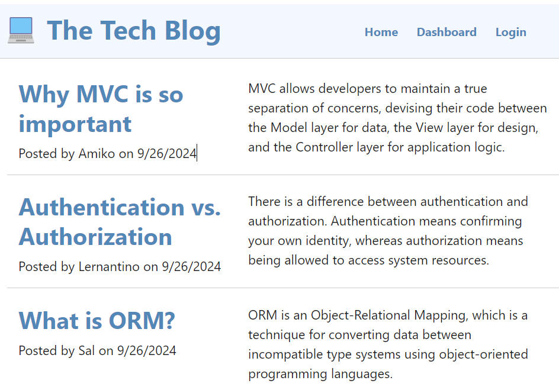
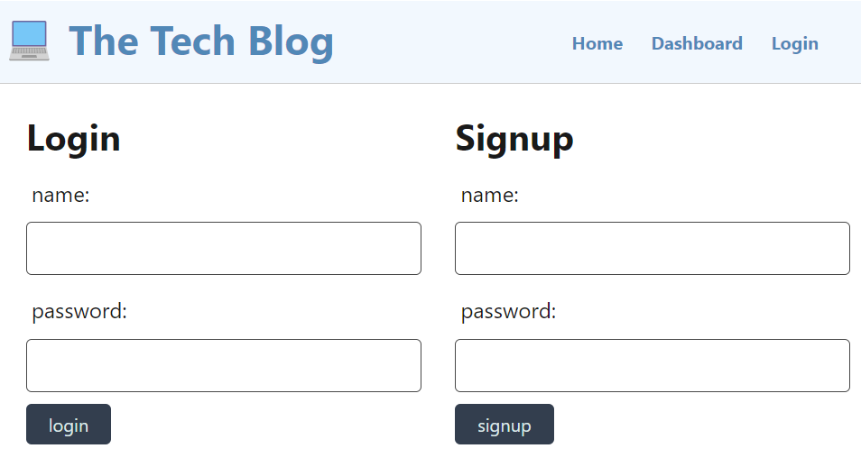
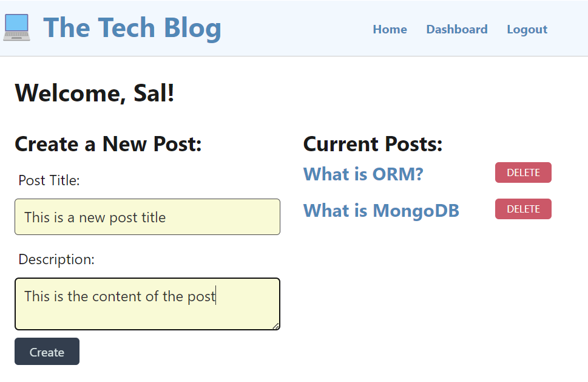
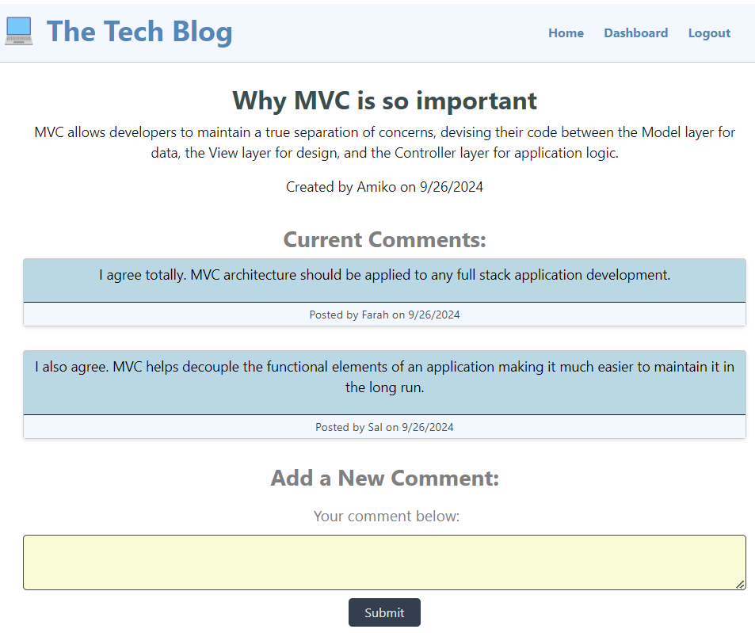

# 14 Model-View-Controller (MVC): Tech Blog

## Summary
In this challenge, we'll build blog site where developers can publish their blog posts and comment on other developers’ posts as well. The program allows all users that visit the site to view all articles that have been posted by other users; however, only logged in users can comment on other users' posts. The logged in users also have the advantage of being able to post new articles to the blog site, or delete them if they no longer wish to share them with other users.

## Technology
The application uses a popular set of frontend and backend technologies to create and support its user driven functions and activities.  The following is an outline of the prominent technologies used in this application:

1. Postgres SQL database for storing and managing the users credentials, posts and comments 

2. Sequalize, a Node.js Object Relational Mapper (ORM) tool, that is used to configure and interact with the Postgres database

3. Express.js for implementing and serving the various routes (APIs) that may be used to perform the standard CRUD (Create, Read, Update, Delete) operations of the database models

4. express-session npm package for user authentication

5. Handlebars.js as the templating language to generate the different pages that the user interacts with on the site

## Architecture
The application architecture is based on the popular Model-View-Controller design pattern that clearly delineates its structural and functional components. The following is an outline of the three architectural constituants that are employed in this application:

1. Model
This component handles the data-related logic, such as interaction with the database to perform the necessary CRUD operations and is supported by Sequalize and Postgres and its central relational database.  The Sequalize schemas that model the application data, include User, Post and Comment.  For details on each particular schema, refer to the corresponding files in the (models) directory. The file (index.js) in the same directory define the relationships between the three models, including the "hasMany" and "belongsTo" relationships that are in turn implemented in the schemas.

2. View
This component refers to presentation layer of the application. It displays the data to the user and sends user commands to the controller. Essentially, it represents the UI. The view in this case is supported by the previously mentioned Handlebars and a collection of JavaScript routines that service the corresponding pages and provide event handling such as processing the user button presses.

3. Controller
The controller acts as an intermediary between the Model and the View. It processes user input, interacts with the model to update the data, and then updates the view accordingly. It contains the business logic of the application. This application uses REST for API routes that include a collection of controllers, including (homeRoutes, userRoutes, postRoutes and commentRoutes).  For the details on the implementation of these routes, refer to the (controllers) folder.

## Application Setup
To provide a headstart in creating and running the Tech Blog site, sample seed data is provided to populate the database models for User and Post. To accomplish the seeding, the following database needs to be created via Postgres's shell:
* techblog_db

A schema.sql is provided for facilitating this task.

Once the database is created, the User and Post models need to be seeded by running the following in the command shell:
* npm run seed

## Operation
Once the database is created and models are seeded, the application may be started by running the following in the command shell:
* npm start

This command starts the server and allows the user to load and interact with the application.  To load the application in your browser, type the following in the address bar: http://localhost:3001/

The following (if-then scenarios) outline the overall functionality and user interactions on the blog site:

```md
GIVEN a CMS-style blog site
WHEN I visit the site for the first time
THEN I am presented with the homepage, which includes existing blog posts if any have been posted; navigation links for the homepage and the dashboard; and the option to log in
WHEN I click on the homepage option
THEN I am taken to the homepage
WHEN I click on any other links in the navigation
THEN I am prompted to either sign up or sign in
WHEN I choose to sign up
THEN I am prompted to create a username and password
WHEN I click on the sign-up button
THEN my user credentials are saved and I am logged into the site
WHEN I revisit the site at a later time and choose to sign in
THEN I am prompted to enter my username and password
WHEN I am signed in to the site
THEN I see navigation links for the homepage, the dashboard, and the option to log out
WHEN I click on the homepage option in the navigation
THEN I am taken to the homepage and presented with existing blog posts that include the post title and the date created
WHEN I click on an existing blog post
THEN I am presented with the post title, contents, post creator’s username, and date created for that post and have the option to leave a comment
WHEN I enter a comment and click on the submit button while signed in
THEN the comment is saved and the post is updated to display the comment, the comment creator’s username, and the date created
WHEN I click on the dashboard option in the navigation
THEN I am taken to the dashboard and presented with any blog posts I have already created and the option to add a new blog post
WHEN I click on the button to add a new blog post
THEN I am prompted to enter both a title and contents for my blog post
WHEN I click on the button to create a new blog post
THEN the title and contents of my post are saved and I am taken back to an updated dashboard with my new blog post
WHEN I click on one of my existing posts in the dashboard
THEN I am able to delete or update my post and taken back to an updated dashboard
WHEN I click on the logout option in the navigation
THEN I am signed out of the site
WHEN I am idle on the site for more than a set time
THEN I am able to view posts and comments but I am prompted to log in again before I can add, update, or delete posts
```
## Future Enhancements
This application in its current form serves as a proof of concept for implementing an MVC model application its objectives are purely academic.

Additional features are undoubtedly needed to make this application more useful.  The following is an outline of upcoming features that are currently in the planning phase:

1. User Profile
The ability to display and edit the user profile such as email and password should be considered given that users may need to change their login credentials from time to time

2. Interactive Elements
Adding polls, quizzes, and interactive infographics can make this Tech blog more engaging and encourage user interactions

3. Email Subscription 
Offering an email subscription option to keep your readers updated with your latest posts and news

4. Related Posts
Displaying related posts at the end of each article to keep readers on the site longer

## Deployment
The application is deployed to the cloud based Render platform featuring continuous development and deployment of the hosted applications.  

## Link to the Live Application
To run the application on the Render platform, click the following link: https://tech-blog-f56r.onrender.com/

## Executing the Application Locally
To run the application locally, perform the following
* Clone the project from: https://github.com/reztndev/Tech-Blog
* Open the project in Visual Studio Code
* Create the database as mentioned above
* Open a terminal and run the following:
1. npm install
2. npm run seed
2. npm start

## Screenshots of the Application



